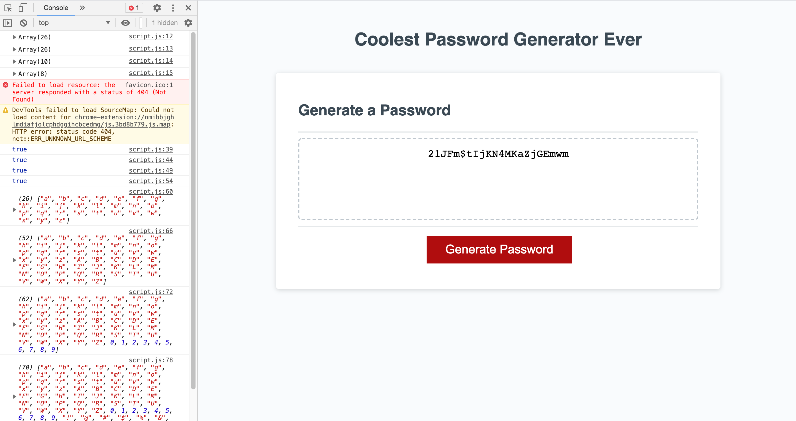

# Coolest Password Generator Ever
## Description
The goal of this assignment was to create an application that generates a random password based on a set of criteria defined by users. Using a series of prompts, confirms, conditionals, and other JavaScript methods, I successfully created a page that does exactly that! I built this project to develop a stronger understanding of how the language is a powerful tool that can be used to make a webpage interactive. 

I learned a lot while working on this assignment, mainly because it helped me practice the more complicated aspects of JavaScript that I have never worked with before. This project really helped to reinforce the JavaScript concepts introduced in the course last week.

## Installation
Below are the steps I took to develop this application: 
1. Review the provided HTML file to identify the elements on the page and how they will affect (or be affected by) the code. 
2. Reviewed the starter code in the script.js file to identify what has already been written and what still needs to be added. 
3. Considered the end goal of this assignment to come up with a list of what needs to be created: 
- Users need to pick a length for their password that is between 8 and 128 characters. I need to create a prompt for the user to input their desired password length and create conditionals to ensure it meets the parameters.
- Users need to be notified if their input does not meet the parameters. I need to create an alert that lets the user know they did not meet the parameters and ensure that the function does not run.
- The user needs to select from four groups of characters: lowercase, uppercase, numeric, and/or special characters. I need to create arrays for each of the character groups. I need to create a series of prompts for the user to choose whether or not they want to include each type of character group in their password.
- The password generated must include all the characters selected by the user. I need to create if statements that concatenate the chosen character groups' arrays to a final array.
- A random password needs to be generated that matches the user's selected criteria. I need to create a for loop that randomly selects values for the password from the final array.
- The generated password needs to be written to the page. A function that writes the password to the page has already been provided. 
4. After outlining what code still needed to be added, I began tackling each individual section. 
- I created the arrays for each character group
- Created a prompt to ask user how many characters they wanted their password to be
- Created an if statement to alert the user if they input did not meet the parameters, then return the function
- Created confirms to ask user if they wanted to include each of the character groups
 - Concatenated character group arrays to a new "final" array if user's response to the confirms above === true
 - Created a for loop that generated a password with random characters from the final array, and was the length defined by the user in the first prompt

## Usage
Link to deployed application: https://go-yasi.github.io/coolest-password-generator-ever/

Below is the screenshot of the application:

## Conclusion
This assignment really intimidated me at first. I had a hard time grasping the JavaScript concepts we learned last week, so trying to write my own JavaScript code seemed almost impossible. 

Before joining office hours with Bryan earlier this afternoon, I was very concerned that I wouldn't be able to complete the project at all. But thankfully, during office hours Bryan patiently walked me through my existing code and notes, and empowered me to feel more confident about how I could get this application working. It was so thrilling walking through each step with his guidance and seeing everything come to life! 

It may sound a bit dramatic, but it was at this moment that I felt like I made a significant breakthrough in my understanding of JavaScript and it was really, really rewarding and motivating! 